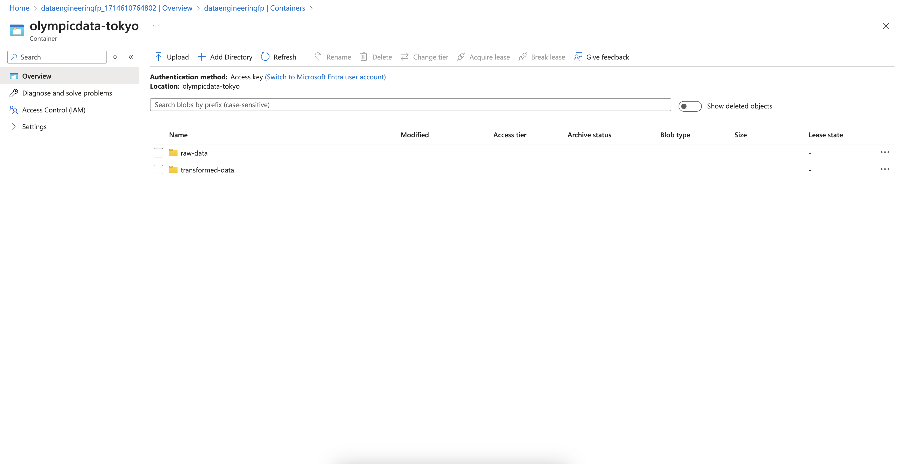
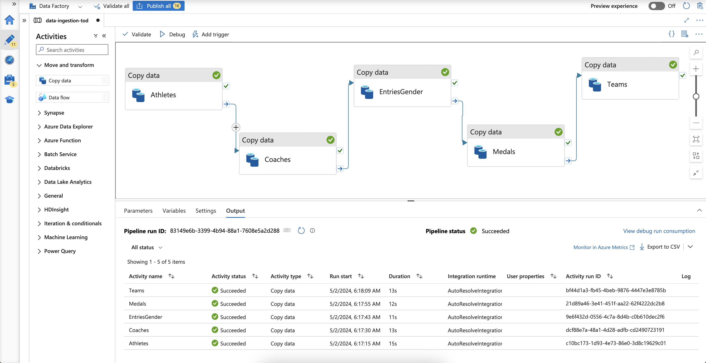
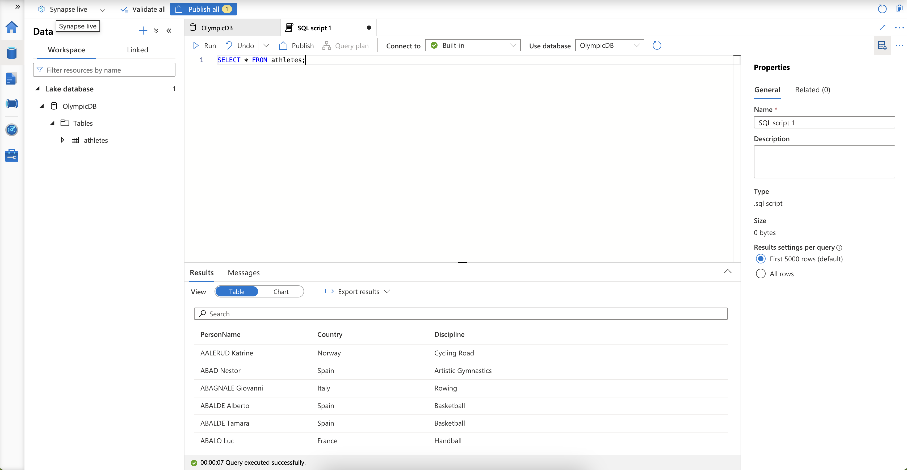
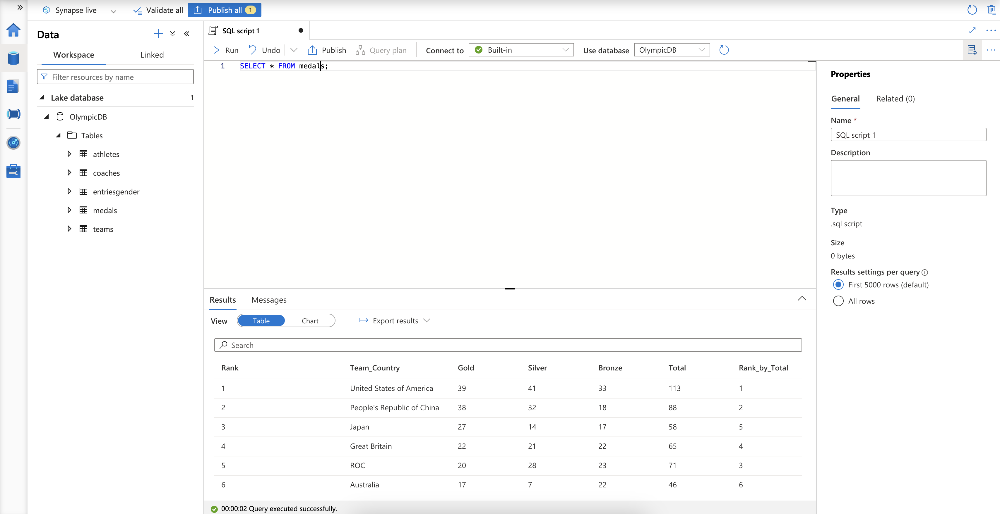

# Olympic Data Analytics on Azure: A Step-by-Step Guide

This tutorial will walk you through building a data pipeline on Azure using Olympic data, focusing on data ingestion, transformation, and loading into a data warehouse for analysis.

## Tools and Prerequisites:

- Stable internet connection and a laptop/computer.
- Basic knowledge of Python and SQL.
- An Azure account (free trial with $200 credit is available).
- Olympic data from Kaggle or the provided GitHub repository.

## Project Stages:

### Data Ingestion with Azure Data Factory:

#### 1. Create Storage Account:
- Search for "storage account" in the Azure portal.
- Click "Create storage account" and choose your subscription, resource group (e.g., "Tokyo Olympic"), and a unique storage account name.
- Select the region, performance (Standard), and enable "hierarchical namespace".
- Review and create the storage account.
- Once deployed, go to "Containers" and create two folders: "raw data" and "transform data".

#### 2. Create Data Factory:
- Search for "data Factory" and click "Create data Factory".
- Choose your subscription, resource group, a unique data factory name, region, and click "Next" through the remaining options.
- Review and create the data factory.
- Go to "Author" and click the "+" icon to create a new pipeline. Name it "data ingestion".

#### 3. Copy Data Activities:
- For each CSV file in the Olympic data source (athletes, coaches, etc.):
  - Click the "+" icon and select "Copy data".
  - In "Source", click "New" and choose "HTTP".
  - Provide a name for the linked service (e.g., "athletes HTTP").
  - Paste the raw URL of the CSV file from the GitHub repository.
  - Set authentication type to "Anonymous" and click "Create".
  - In "Sink", click "New" and choose "Azure Data Lake Storage Gen2".
  - Provide a name for the linked service (e.g., "athletes sync").
  - Select your storage account, browse to the "raw data" folder, and provide the file name.
  - Ensure "First row as header" is checked and click "OK".
  - Connect the source and sink in the pipeline.
  - Validate and debug the pipeline to ensure successful data copying.
  - Verify that the files are present in the "raw data" folder of your storage account.
 
  

### Data Transformation with Azure Databricks:

#### 1. Create Databricks Workspace:
- Search for "databricks" and click "Create Azure Databricks".
- Choose your subscription, resource group, a unique workspace name, region, and pricing tier (Standard or Premium).
- Click "Next" through the remaining options and review and create the workspace.
- Launch the workspace and create a new compute resource (single node is sufficient for this tutorial).

#### 2. Connect Databricks to Data Lake:
- Create a new notebook in Databricks and name it "Tokyo Olympic Transformation".
- Follow the instructions in the provided notebook to:
  - Register an app in Azure Active Directory and obtain the client ID, tenant ID, and secret key.
  - Mount the Data Lake storage to Databricks using the obtained credentials.
  - Grant the app access to the storage container through Access Control (IAM) and assign the "Storage Blob Contributor" role.

#### 3. Read and Transform Data:
- Use Spark code to read each CSV file from the "raw data" folder.
- Perform necessary transformations, such as:
  - Changing data types (e.g., from string to integer for numerical columns).
  - Renaming columns for clarity.
  - Calculating new columns (e.g., average number of entries per gender).
  - Filtering or grouping data based on requirements.

#### 4. Write Transformed Data:
- Use Spark code to write each transformed data frame to the "transform data" folder in your storage account.
- Use options like "overwrite" and "partition" to manage data writing.
- Verify that the transformed files are present in the "transform data" folder.

### Data Loading and Analysis with Azure Synapse Analytics:

#### 1. Create Synapse Workspace:
- Search for "synapse analytics" and click "Create Synapse workspace".
- Choose your subscription, resource group, a unique workspace name, region, and select your storage account.
- Click "Next" through the remaining options and review and create the workspace.
- Launch the Synapse Studio.

#### 2. Create Database and Tables:
- Click on the "Data" tab and create a new database (e.g., "Tokyo Olympic DB").
- For each transformed CSV file:
  - Click the "+" icon on "Tables" and choose "From data lake".
  - Provide a table name (e.g., "athletes").
  - Select the corresponding file from the "transform data" folder.
  - Ensure the schema is detected correctly and click "Create".
  - Validate and publish the tables.

#### 3. Analyze Data with SQL:
- Use the built-in SQL editor to write queries and explore the data.
- Perform aggregations, calculations, and filter data based on your analysis goals.
- Visualize the data using the charting tools within Synapse Studio.

### Challenge:

You can Build a dashboard using Power BI, Tableau, or other visualization tools to present insights from the Olympic data.

## Additional Notes:

- Explore the documentation and features of each Azure service for deeper understanding.
- Consider utilizing Azure Key Vault to store sensitive credentials securely.
- This project provides a foundation for building more complex data pipelines and analytical workflows on Azure.
